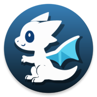

# RyuuPlay



[](https://strider.kuro.ryuu.eu/keeshii/ryuu-play/)
[](https://matrix.to/#/#ryuu-play:matrix.org)

RyuuPlay is a simulator for the Pokémon Trading Card Game written in TypeScript. The source code is entirely open source and published under MIT licence.

The project is created for the educational purpose only. There is no plans to port all possible cards or provide new features.
Think of it as a platform for testing various approaches for AI bots implementaion. RyuuPlay is triggering random bot vs bot
matches at regular basis and updates ranking. Of course it is also possible to just play with the bot and have some fun.

### Demo

An example server instance with some AI bots included. To create an account you need to provide the password `letsplaypokemontcg`.

Web page:
https://ptcg.ryuu.eu/

Android application:
[RyuuPlay-latest.apk](https://ptcg.ryuu.eu/RyuuPlay-latest.apk)

Screenshots:
[00.png](https://github.com/keeshii/ryuu-play/raw/master/fastlane/metadata/android/en-US/images/phoneScreenshots/00.png)
[01.png](https://github.com/keeshii/ryuu-play/raw/master/fastlane/metadata/android/en-US/images/phoneScreenshots/01.png)

### Project overview

The project consists of several packages:

* **@ptcg/common** is a library shared by both client and server. It provides generic data types and game logic.

* **@ptcg/sets** is a package with list of availabe cards and its implementation.

* **@ptcg/server** is a game server. It is responsible for database and propagating game state to the connected clients by websockets.

* **@ptcg/play** is a web application written in Angular. It displays the game state and allows interaction with the server.

* **@ptcg/cordova** is a cordova wrapper for the ptcg-play package, so it can be running as an android application. This has some advantages like storing card images in the cache or avoiding CORS issues.

### Node and npm version

The entire system is written in TypeScript and requires node.js for compilation, test execution and runnning. The repository is a "monorepo" (multiple packages in one repository) and it is managed by npm workspaces. Npm supports workspaces starting with version 7.

Additionaly the server package needs database (the project was tested with sqlite and mysql).

Prerequisites:
* Node.js 18.19 or higher
* npm 7 or higher
* mysql-5 or sqlite-3

For compability with lower versions of node check the branch `0.0.x`, which works without workspaces.

### Running the project

After clonning the repository:

1. Firstly install all required dependencies

```
npm install
```

2. Then, build all packages

```
npm run build --workspaces
```

3. Start the application
```
npm start
```

The service should now listen on the specified address and port. It will be http://localhost:12021, when no changes has been made to the config files.

### Card images

In the early versions of this application, card scans were committed to the repository. This is not a good solution, because it causes the repository to be large. Currently, the repository does not contain card images, and they are downloaded when the server is first started.

If the card image file does not exist, it is downloaded and saved to disk. The following values ​​from the configuration file are important here:

```
// Directory where the scans will be saved on the disk
config.sets.scansDir = __dirname + '/scans';
// External location, where the scan images will be downloaded from
config.sets.scansDownloadUrl = 'https://ptcg.ryuu.eu/scans';
```

If your server is publicly accessible, it can serve as an image source for another server.

### Server configuration (init.js)

The project configuration can be changed by modifying the JavaScript file. By default, the `init.js` file located in the main folder of this repository is loaded, but you can specify a different file by providing the appropriate parameter when starting the server.

```
npm run start -- --init=./some-other-init.js
```

#### Network interface and port

The common change is the listening interface and port. By default the service is running on port `12021`. If you decide to change the port, you will probably need to modify the `apiUrl` in the client, otherwise the client won't be able to connect to your server. See the section "Client configuration" for more details.

```
// init.js
const { config } = require('@ptcg/server');

config.backend.address = '0.0.0.0'; // listen on all interfaces
config.backend.port = 8000;
```

You can see all avaliable options directly in the source code, in the file `packages/server/src/config.ts`.

#### Storage

By default the server is using the sqlite-3 database. If you want to run it with mysql, some changes in the `init.js` are required. An example configuration is presented below. You may check [typeorm](https://typeorm.io/#/) web site to investigate more connection capabilities.

```
config.storage.type = 'mysql';
config.storage.host = 'localhost';
config.storage.port = 3306;
config.storage.username = 'root';
config.storage.password = '';
config.storage.database = 'name';
```

#### Managing cards

The cards are implemented on the server side. It is not required to rebuild the client after adding/modyfing the cards, because all the simulation is handled by the server and list of available cards are downloaded by clients after successful login. This guarantees consistency between clients.

Currently there are about 250 cards added to the project. You may find them in the the directory `packages/sets`. If you wish to add some more cards, it is the good place to look into.

```
const { CardManager } = require('@ptcg/common');
const sets = require('@ptcg/sets');

const cardManager = CardManager.getInstance();
cardManager.defineSet(sets.setDiamondAndPearl);
cardManager.defineSet(sets.setOp9);
cardManager.defineSet(sets.setHgss);
```

The app also supports game formats. The game format defines which cards are allowed to play and the default set of rules.

```
const { CardManager, Rules } = require('@ptcg/common');
const sets = require('@ptcg/sets');

const cardManager = CardManager.getInstance();
cardManager.defineFormat('Standard', [
  sets.setDiamondAndPearl,
  sets.setBlackAndWhite
]);

cardManager.defineFormat('Extended', [
  sets.setDiamondAndPearl,
  sets.setBlackAndWhite,
  sets.setOp9,
  sets.setHgss
], new Rules({ // rules (optional)
  firstTurnDrawCard: true,
  firstTurnUseSupporter: false
}));
```

It's fine to reuse same sets in multiple formats. The game engine will handle this situation and it will not result in multiple clones of the same card being stored in memory.

#### Adding bots

You can create autonomous AI players on your private server. They work as regular player that always has time to play with you. Initially there is one bot loaded, called `bot`, of course you can always add more. They are defined in the file `ptcg-server/start.js`.

```
const { BotManager, SimpleBot, config } = require('@ptcg/server');

config.bots.defaultPassword = 'bot';

const botManager = BotManager.getInstance();
botManager.registerBot(new SimpleBot('bot'));
```

SimpleBot is the universal AI implementation that should be capable of playing with any deck. It creates list of possible actions, simulates the outcome and compares the score of the game state. Then chooses the best possible action and repeats the process until its turn is over. For more details check the source code at `packages/server/simple-bot`.

Server is automatically creating an account for bot user with password provided in the `init.js` file. You can login as that user, define its deck and set an avatar. AI player won't be able to accept the game invitation until you provide him a valid deck. If you define more than one deck, then each time bot will randomly choose one.

### Building client (Angular)

The client is an Angular application. For more detailed setup information, you may visit the page https://angular.io/. The source code of the client is located in the `packages/play` directory. For development, it is convenient to run the client in a separate process. The client depends on the `@ptcg/common` package, so first make sure you have the latest version of that package built:

1. Build `@ptcg/common` (if not done)
```
npm run build -w package/common
```

2. Now start the app in development mode:
```
npm run start -w package/play
```

The command above will start the application in the debug mode at http://localhost:4200.

3. To build the production package of the client, use following command:
```
npm run build -w package/play -- --configuration production
```

### Client configuration

The project's `packages/play/src/environments/` directory contains the base configuration file, `environment.ts`, which provides the default configuration for development (`apiUrl` is set to localhost). There are two more configurations defined in the project: `environment.prod.ts` - for web browser, and `environment.cordova.ts` for android app.

Those values are compiled together with the client's source code and cannot be modified afterwards.

Some client's environment properties:
* **apiUrl** is the default server url, which client will try to connect to.
* **allowServerChange** displays an additional option on the login window, that allows user to change the server url.
* **enableImageCache** enables cache, so the card images are stored in the phone memory and not downloaded from server every time (android).

### Building Android application (cordova)

Building an android wrapper is a little more complicated than the web client. The android-sdk or android studio must be installed on the computer first.

1. Building the client for the cordova wrapper. The command below should produce the client binaries and place the in the directory `packages/cordova/www`.
```
npm run build -w package/cordova
```

2. Create android project with cordova.

```
npx -w packages/cordova cordova platform add android
```

3. Now let's apply some patches to the cordova sources to correct the scale for the phones/tablets.

```
npm run patch-cordova -w packages/cordova
```

4. Use cordova to build the android application.

```
npx -w packages/cordova cordova build android --release
```

You may find more detailed instruction on the https://cordova.apache.org/

### License

MIT
